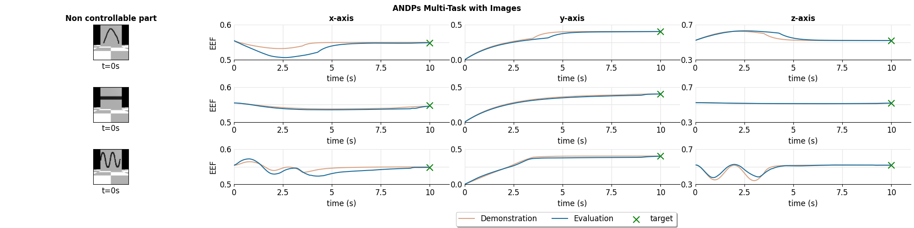
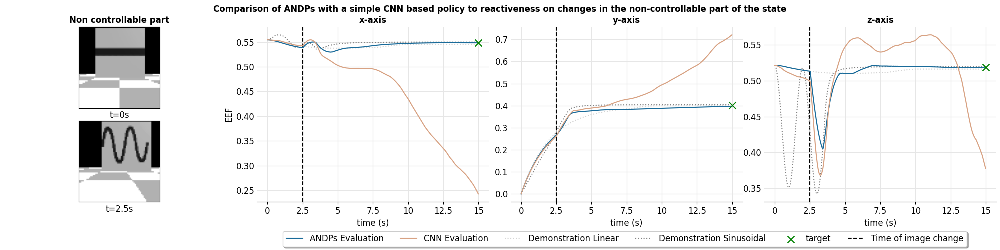
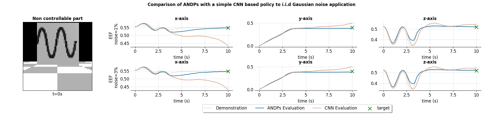

# Imitating Robotic Behaviors (Experiment 2)

# Pipeline

# Results

## Multi Task Images

## Reactiveness on changes to the non controllable part of the stae

## Robustness to external force application

## Robustness to i.i.d. Gaussian noise application

