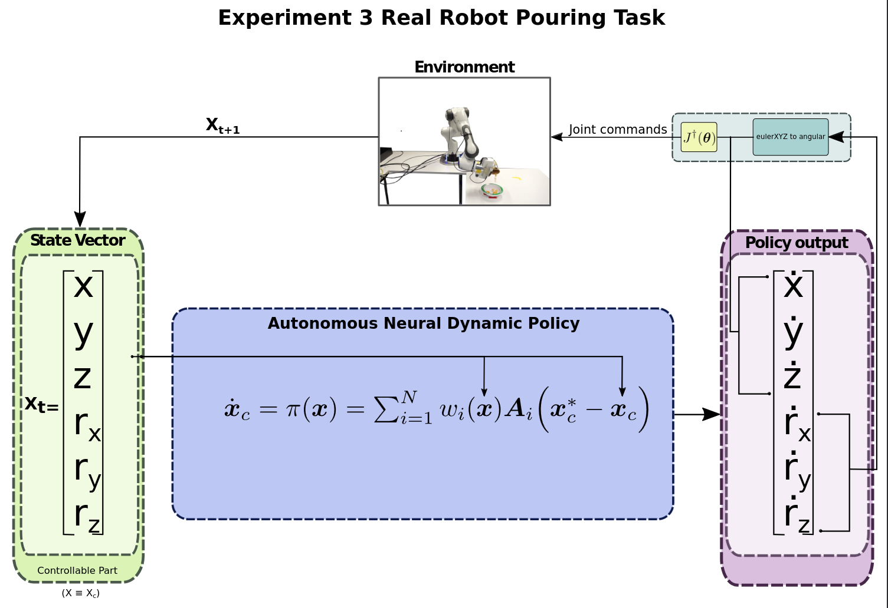

# Physical Robot Experiment Pouring Task (Experiment 3)
With this experiment we showcase that ANDPs:
- Work with realistic demonstrations,
- and can learn a task that requires precision and end-effector orientation control

No evaluation script is provided since the trained policy was directly tested into the real robot.
## Pipeline

## Results

https://github.com/AnonymousSumbission/andps_code/assets/156198603/e0ba5f8a-48ad-4b9a-8b40-418c74c0a2b6

| Replication | Percentage of objects inside the bowl |
|-------------|---------------------------------------|
| 1st         | 90%                                   |
| 2nd         | 100%                                  |
| 3rd         | 50%                                   |
| 4th         | 60%                                   |
| 5th         | 100%                                  |
| 6th         | 100%                                  |
| 7th         | 100%                                  |
| 8th         | 30%                                   |
| 9th         | 100%                                  |
| 10th        | 100%                                  |
